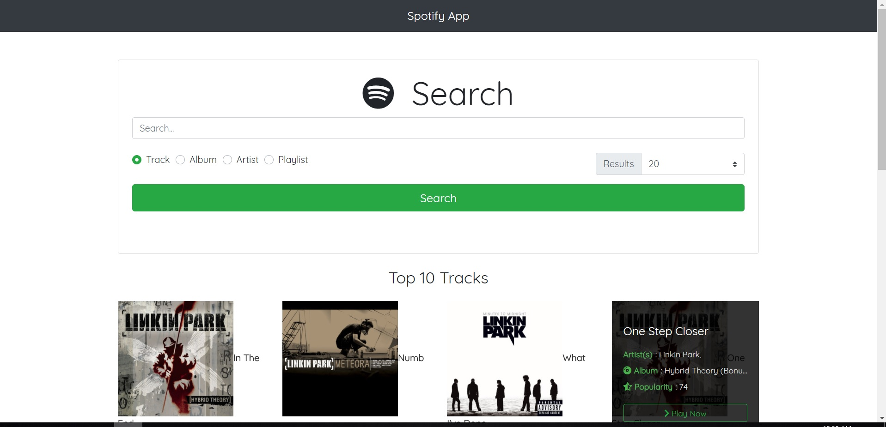
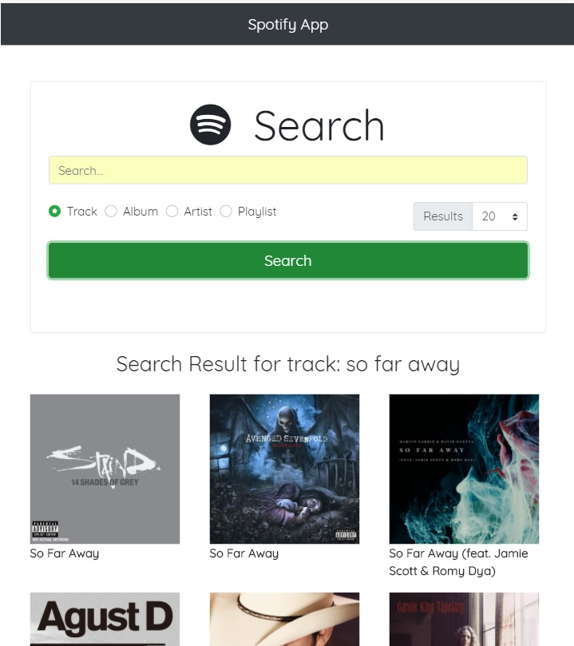
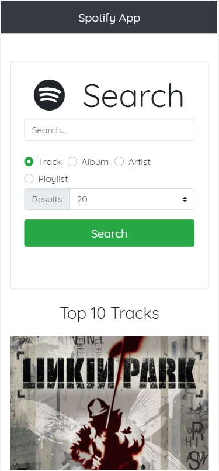

# Spotify-App

This is a sample app to search spotify tracks, albums, artists and playlists. Using the application user can search based on the above catogories and able to select the search result count.
To make api calls [axios](https://github.com/axios/axios) is used, for styleing [bootstrap](https://getbootstrap.com/) and for icons [font-awesome](https://fontawesome.com/icons?d=gallery) is used.
The application support all three viewport (desptop, tablet and mobile).

## Setup the project

-   Clone the project from the repository [spotify-app](https://github.com/chanarus/spotify-app)
-   Run following commands in the root folder to setup the project.
    for npm
    ```bash
       npm install
    ```
    ```bash
       npm start
    ```
    for yarn
    ```bash
       yarn
    ```
    ```bash
       yarn start
    ```

## Screens




